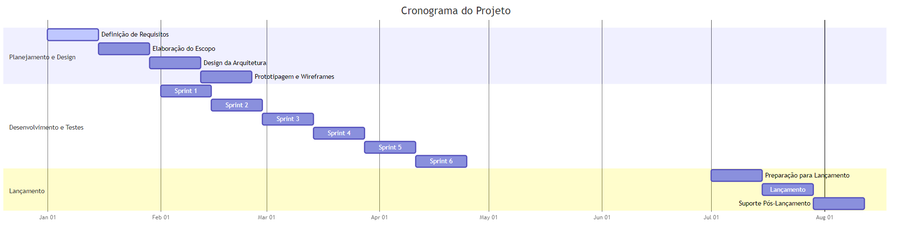
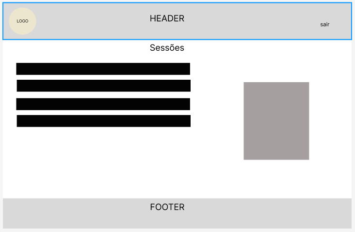
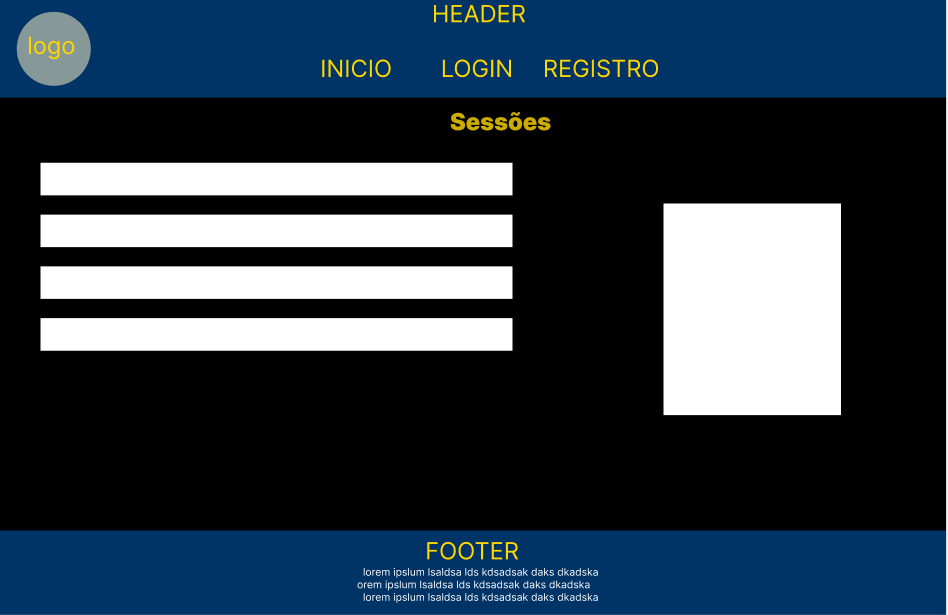
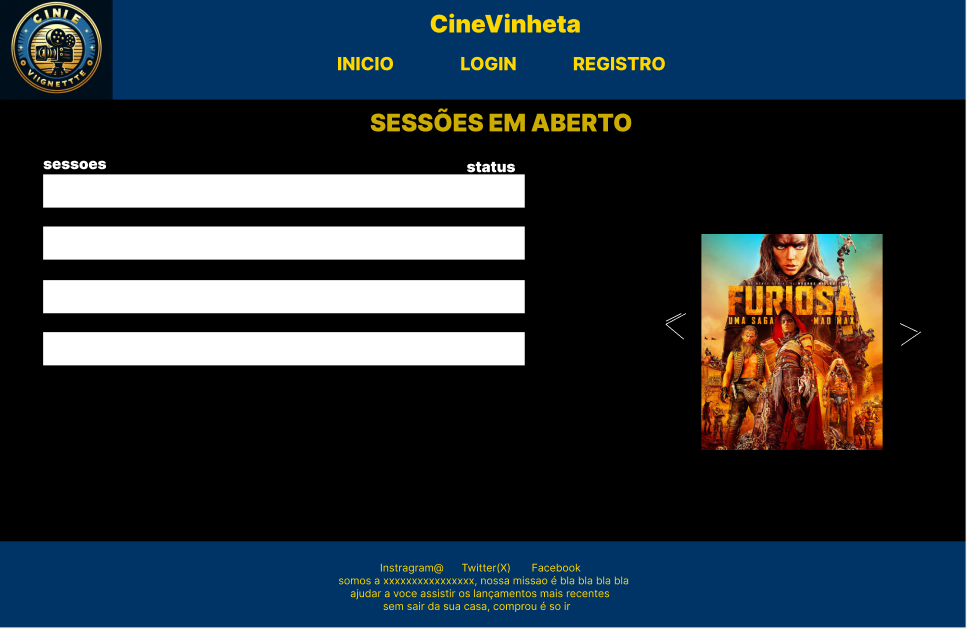

# 1. Metodologias de Desenvolvimento
### **Metodologia Escolhida**: Ágil (Scrum)
**Justificativa**: Foco na adaptação contínua com ciclos de entregas incrementais, possibilitando a integração de novas funcionalidades a cada sprint, baseadas no feedback do cliente.

---

# 2. Apresentação do Projeto
## **Objetivos SMART**:

### **Específico**:
- CRUD completo de sessões e ingressos.
- Interface intuitiva para pesquisa, seleção e compra de ingressos.
- Autenticação segura de usuários.

### **Mensurável**:
- Fluxo de compra com no máximo **3 cliques**.
- Suporte para **200 usuários simultâneos**.
- Compra finalizada em até **4 minutos**.

### **Atingível**:
- Equipe multidisciplinar com especialistas em desenvolvimento, design e infraestrutura.
- Tecnologias robustas para garantir performance e escalabilidade.

### **Relevante**:
- Melhoria na usabilidade do sistema de reservas, promovendo uma experiência de compra eficiente e satisfatória para o cliente.
- Redução de filas presenciais e aumento de vendas online.

### **Temporal**:
- Planejamento e design: **1 mês**.
- Desenvolvimento e testes: **5 meses** (sprints quinzenais).
- Lançamento final: **6 meses**.

---

# 3. Escopo

## **Usuários Administrativos (cinema)**:
### **Gestão Avançada de Sessões**:
- CRUD completo de sessões e programação de filmes.
- Configuração de preços diferenciados por horário e promoção.
- Relatórios dinâmicos sobre vendas e ocupação das salas.

### **Administração de Usuários**:
- Gestão e controle de usuários com permissões personalizadas.

---

## **Clientes**:
### **Interface de Compra**:
- Pesquisa avançada de filmes e horários com filtros por data, gênero e localização.
- Exibição de detalhes do filme com sinopses, trailers e imagens.
- Carrinho de compras dinâmico e processo de checkout otimizado.

### **Histórico e Rastreamento**:
- Acompanhamento de ingressos comprados e histórico de sessões.
- Notificações automáticas sobre eventos e promoções.

---

## **Sistema**:
### **Autenticação e Cadastro**:
- Registro de usuários com autenticação multifatorial para maior segurança.

### **Funcionalidades Extras**:
- Integração com múltiplos gateways de pagamento.
- Notificações sobre lançamentos e promoções.
- Responsividade e acessibilidade para dispositivos móveis.

---

# Cronograma Detalhado

## 1. Planejamento e Design (1 mês)

### **Semana 1-2**
- **Definição de Requisitos**:
  - Reunião com stakeholders para entender necessidades e expectativas.
  - Documentação dos requisitos funcionais e não funcionais.
  
- **Elaboração do Escopo**:
  - Criação do escopo do projeto, incluindo objetivos e entregáveis.
  - Revisão e aprovação do escopo.

### **Semana 3-4**
- **Design da Arquitetura**:
  - Desenvolvimento da arquitetura do sistema.
  - Escolha das tecnologias e ferramentas a serem usadas.
  
- **Prototipagem e Wireframes**:
  - Criação de wireframes e protótipos das principais interfaces.
  - Revisão e feedback dos protótipos com stakeholders.

## 2. Desenvolvimento e Testes (5 meses)

# 5. Recursos

### **Equipe**

1. **Desenvolvedores**:
   - **Back-end**: 2 desenvolvedores especializados em construção de APIs e integração com bancos de dados.
   - **Front-end**: 2 desenvolvedores com experiência em frameworks modernos (React, Vue.js, Angular).
   - **Full-stack**: 1 desenvolvedor para conectar o front-end e back-end, garantindo a integridade do sistema.

2. **Designers de UI/UX**:
   - **UI Designer**: 1 designer responsável pela criação de interfaces visuais atraentes e funcionais.
   - **UX Designer**: 1 designer focado na experiência do usuário, incluindo pesquisa, prototipagem e testes de usabilidade.

3. **Analistas de Qualidade**:
   - **QA Manual**: 1 analista para testes manuais e criação de casos de teste.
   - **QA Automatizado**: 1 analista para criação e manutenção de testes automatizados e scripts de teste.

4. **Gerente de Projeto**:
   - **PM**: 1 gerente de projeto para coordenar atividades, gerenciar cronograma e garantir a comunicação entre as partes interessadas.

### **Ferramentas e Software**

1. **Desenvolvimento**:
   - **IDE**: Visual Studio Code, IntelliJ IDEA, WebStorm.
   - **Versionamento de Código**: Git (GitHub, GitLab, Bitbucket).
   - **Gerenciamento de Pacotes**: npm (Node Package Manager), yarn.

2. **Design e Prototipagem**:
   - **Design de UI/UX**: Figma, Adobe XD, Sketch.
   - **Protótipos Interativos**: InVision, Marvel.

3. **Testes e Qualidade**:
   - **Automação de Testes**: Selenium, Cypress.
   - **Gerenciamento de Testes**: Jira, TestRail.

4. **Infraestrutura e Hospedagem**:
   - **Servidores na Nuvem**: AWS (Amazon Web Services), Google Cloud Platform, Azure.
   - **Hospedagem e Deploy**: Heroku, Netlify, Vercel.
   - **Monitoramento e Logs**: Datadog, New Relic, Sentry.

5. **Comunicação e Colaboração**:
   - **Comunicação**: Slack, Microsoft Teams.
   - **Gerenciamento de Projetos**: Jira, Trello, Asana.
   - **Documentação**: Confluence, Notion, Google Docs.

### **Escalabilidade**

1. **Escalabilidade Horizontal**:
   - **Servidores**: Adição de novos servidores para lidar com o aumento da carga de trabalho.
   - **Serviços**: Microserviços para dividir a carga de trabalho entre diferentes serviços e garantir uma melhor performance.

2. **Escalabilidade Vertical**:
   - **Recursos de Computação**: Aumento da capacidade dos servidores existentes para suportar mais processamento e armazenamento.

3. **Backup e Recuperação**:
   - **Backups Regulares**: Backup automático de dados e configuração para garantir recuperação rápida em caso de falhas.
   - **Planos de Recuperação**: Planos detalhados de recuperação de desastres e procedimentos de backup.

---

# 6. Análise de Riscos

### **Segurança**:
- **Risco**: Potenciais ataques aos dados sensíveis dos usuários.
  - **Mitigação**: Implementação de criptografia SSL e autenticação multifatorial.

### **Indisponibilidade**:
- **Risco**: Queda de servidores durante eventos de pico.
  - **Mitigação**: Escalabilidade em nuvem para suportar tráfego elevado.

### **Usabilidade**:
- **Risco**: Interface complexa que afeta a experiência do usuário.
  - **Mitigação**: Realizar testes de usabilidade e coletar feedbacks ao longo do desenvolvimento.

---

# 7. Diagramas de Desenvolvimento

### **Diagrama de Casos de Uso do Cliente**

### **Diagrama de Casos de Uso do ADM**

---

### **Diagrama de Fluxo - Reserva de Ingresso**:

### **Imagem do Diagrama de Fluxo**

### **FLuxo do ADM**

### **Diagrama de Classes**

### Diagrama de Classes:
- **Sessão**:
  - **Atributos**: ID, Filme, Data, Horário, Preço.
  - **Métodos**: criarSessao(), atualizarSessao(), deletarSessao().
- **Cliente**:
  - **Atributos**: ID, Nome, Email, Senha.
  - **Métodos**: registrar(), login(), atualizarPerfil(), comprarIngresso().
- **Reserva**:
  - **Atributos**: ID_cliente, ID_sessão, Quantidade, Status.
  - **Métodos**: criarReserva(), cancelarReserva(), obterReserva().
  

### Prototipo

#### Baixa Fidelidade

 
 

#### Média Fidelidade

 
 

#### Alta Fidelidade

